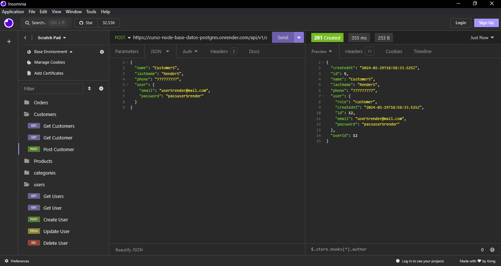

# Welcome! 👋

This is a API REST with Express.js + Database with PostgreSQL

### Screenshot
.png)
.png)


### Links
- Live Site URL: [API REST](https://curso-node-base-datos-postgres.onrender.com)

## Routes

### Products
- <span style="background: #593d7f; color: white; bold"> **[ GET ]**</span> /api/v1/products
- <span style="background: #593d7f; color: white; bold"> **[ GET ]**</span>/api/v1/products/id
- <span style="background: #73b32b; color: white; bold"> **[ POST ]**</span> /api/v1/products
- <span style="background: #d3c137; color: white; bold"> **[ PATCH ]**</span> /api/v1/products/id
- <span style="background: #93312c; color: white; bold"> **[ DELETE ]**</span> /api/v1/products/id

### Categories
- <span style="background: #593d7f; color: white; bold"> **[ GET ]**</span> /api/v1/categories
- <span style="background: #593d7f; color: white; bold"> **[ GET ]**</span> /api/v1/categories/id
- <span style="background: #73b32b; color: white; bold"> **[ POST ]**</span>/api/v1/categories
- <span style="background: #d3c137; color: white; bold"> **[ PATCH ]**</span> /api/v1/categories/id
- <span style="background: #93312c; color: white; bold"> **[ DELETE ]**</span>/api/v1/categories/id

### Users
- <span style="background: #593d7f; color: white; bold"> **[ GET ]**</span> /api/v1/users
- <span style="background: #593d7f; color: white; bold"> **[ GET ]**</span>  /api/v1/users/id
- <span style="background: #73b32b; color: white; bold"> **[ POST ]**</span> /api/v1/users
- <span style="background: #d3c137; color: white; bold"> **[ PATCH ]**</span> /api/v1/users/id
- <span style="background: #93312c; color: white; bold"> **[ DELETE ]**</span>/api/v1/users/id

### Customers
- <span style="background: #593d7f; color: white; bold"> **[ GET ]**</span> /api/v1/customers
- <span style="background: #593d7f; color: white; bold"> **[ GET ]**</span>  /api/v1/customers/id
- <span style="background: #73b32b; color: white; bold"> **[ POST ]**</span> /api/v1/customers
- <span style="background: #d3c137; color: white; bold"> **[ PATCH ]**</span> /api/v1/customers/id
- <span style="background: #93312c; color: white; bold"> **[ DELETE ]**</span>/api/v1/customers/id

## Running in your local machine
Clone the repository:
```sh
git@github.com:LiwGar/curso_node_base_datos_postgres.git
```
Move to the api folder:
```sh
cd node_express
```
Install dependencies:
```sh
npm i
```
Run it!
```sh
npm run start
```

### Built with
- Git & Github.
- Docker
- NPM.
- Node.js
- Express.js
- JavaScript
- PostgreSQL
- Sequelize
- Joi
- @hapi/boom
- Nodemon

### What I learned
- Backend with Node.js.
- Installation and basic configuration of Docker,
- Creating and working with PostgreSQL and MySQL containers,
- Connection with ORM Sequelize,
- Creating table models for entities,
- Resolving relationships between entities,
- Switching between SQL databases,
- CRUD operations with Sequelize,
- Applying virtual properties,
- Database migrations,
- API connected to PostgreSQL (Resolved associations, Endpoints for each entity, Migrations, Clean architecture),
- Clean and scalable architecture by layers (Model, Schema, Controller or Routes, Service),
- Deployment to production on Render.

### The objective is:
- Improve the development with Node.js and Databases.
- Never stop learning.

## Author
- Website - [LiwGar](https://liwgar-portfolio.vercel.app/)
  
